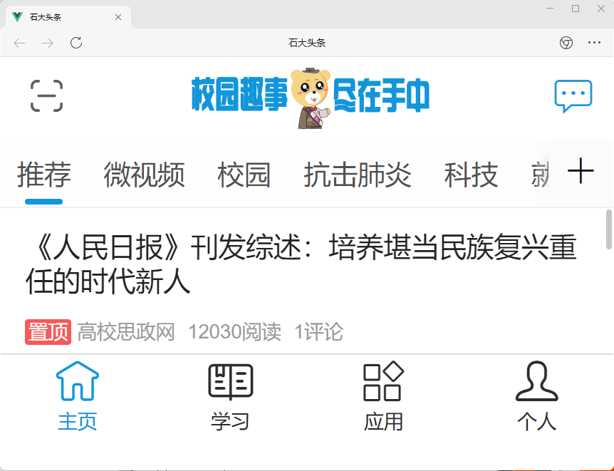
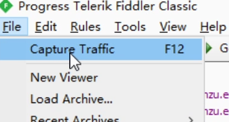
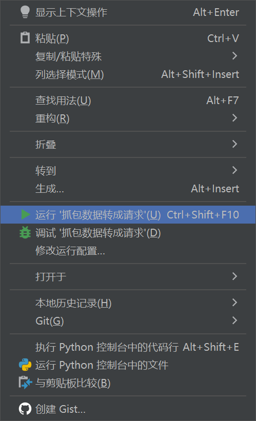

# 石河子大学战疫情自动打卡
## 免责声明
1.为了防止疫情再次扩散，我们一定要如实汇报自己的个人情况，不隐瞒真实状况。

2.但也是为了一定程度减少形式主义，抽出更多的时间去为社会主义建设贡献力量，推荐shzu莘莘学子Star此项目。

3.此申明致敬郑州大学自动打卡项目，respect所有与形式主义做斗争的人们。

## 注：
- 2022/10/23 update:

请切换分支，查看使用两个脚本，借助华为云函数定时执行实现的自动打卡（shzu战疫情打卡V2.0）！！！

这个版本（shzu战疫情打卡V1.1）对于新手来说是脱裤子放屁对于有基础的朋友们更是脱裤子挠痒，V2.0版本在抓包后，转换成请求，直接部署在华为云上即可。具体请切换分支查看。

- 2022/10/22 update：

昨天睡觉前忽然意识到自己陷入了思维定势，在被通报后只顾着生气，没有思考最优解就盲目coding。
本脚本的出发点在于，考虑到更多朋友使用的是windows电脑，相比于服务器上的定时任务，本脚本只要一次成功配置（可配置多人）就可以在后台循环执行（要以命令行方式启动）。

目前的构思是：在把本项目全部完成后，在另一个branch上完成两个独立的脚本，利用市面上的免费云函数功能定时执行。

## 使用方法
在此假定你是一个没有代码基础，但是不知道从哪里看到这个项目的shzuer。也苦每天形式主义的打卡久矣，因此本使用方法目的在于帮助没有代码基础的小伙伴们也可以完成配置并运行，我会尽量通俗易懂的表达你需要一步一步完成的事，在开始之前你需要进行的准备工作有：
- 一台24小时不关机不休眠的电脑（假定你没有服务器，并且在电脑中设置好了不休眠）
- 搭建Python环境（必应上一搜一大把教程）（夹带私货时间：拒绝百度人人有责）
- 代码编辑器，推荐PyCharm，编辑器可以帮助你找出语法以及格式上的错误，新手友好
- 下载安装电脑版企业微信
- 下载安装Fiddler Classic用来抓包
### 使用Fiddler Classic抓包

1.登录企业微信。

2.打开Fiddler Classic，不要被花里胡哨的页面吓到哦。

3.企业微信点击下方石大头条，并完成一次重新打卡。




4.返回Fiddler Classic，左上角：File-Capture Traffic前面的勾勾取消掉。



5.在Fiddler Classic左侧，找到如下两条,分别右键save，selectd sessions，as text并按顺序命名为login.txt和sendmsg.txt。


6.把上面两个txt文件放到你的项目文件夹内。


### 获取你的登录信息以及打卡信息

#### 注：此步其实已经可以从你的txt文件中获取了。考虑到朋友们不一定能在连接超时前完成所有步骤，还是建议跟着此步一起做，并每两小时至少进行一次请求保证不超时。（下面会详细说）
1.打开"抓包数据转成请求.py",将"str_filename"后双引号内容依次改为上面两个txt的文件名，并依次运行。
```
#1.修改第三行双引号内为login.txt
str_filename = "login.txt"
#右键运行

#1.修改第三行双引号内为sendmsg.txt
str_filename = "sendmsg.txt"
#右键运行
```

右键运行如下图所示：



2.成功运行两次后文件夹内会出现两个与上面txt文件同名但后缀为.py的文件。


3.试着右键运行"login.py"，出现如下运行结果。控制台出现信息包含“登录成功 ！”即表明登录未过期。
**记住：从现在开始，在完成所有配置程序自动保持连接前，你至少需要保证每两小时手动运行一次"login.py"。**


至此，你的登录信息和打卡信息已经成功获取，接下来进行配置。

### 配置个人信息

_回过头欣赏自己作品时候发现的错误：139行和193行url也要记得修改哦。_

注意：你需要修改的内容在48行至110行，235至237行内，并且建议逐个修改。因为Python是缩进严格的，你需要保证修改的时候格式不能乱。

1.配置你的姓名，从现在开始你叫张三，不愿意的话我也可以叫你李四。
```
#第48行
userList = ["zs"]
#修改为
userList = ["zs"]

#第50行至52行，此处的邮箱是zs的邮箱
mail = {
    "name": "xxxxxxxxx@qq.com"
}
#修改为
mail = {
    "zs": "替换成张三的邮箱@qq.com"
}

#第56行
        "name":
#修改为
        "zs":
#同理：77、90、103行，将name替换成zs，此处不再演示。

```
2.打开"sendmsg.py"，配置你的打卡信息。
找到data关键字，在后面花括号里的内容就是你的打卡数据，你需要修改的内容在58行至70行之间：
```commandline
#把如下关键字冒号后单引号包裹住的内容修改为你你在"sendmsg.py"-data里相匹配的内容，地址数据是进行了url编码的，乐意的话你也可以url decode后替换进去。
'dwaddress'
'wxprovince'
'wxcity'
'longitude'
'latitude'
'deviceid'
```
在第78行至83行，msgHeadersData里内容同样用"sendmsg.py"里headers后面内容一一对应替换。

此处不做演示。

在第103至107行，cookiesData里内容同样用"sendmsg.py"里cookies后面内容一一对应替换。

此处不做演示。

3.打开"loginin.py"，配置aliveHeadersData。

在91至96行，配置aliveHeadersData里内容同样用"loginin.py"里headers后面内容一一对应替换。

至此你的个人信息配置完毕，接下来配置你的邮箱信息。记得手动执行"login.py"保证连接不失效哦。

### 配置邮箱信息

虽然如果你打卡失败了会有无数人提醒你，但早上醒来看见成功打卡的邮件提醒能给你带来安心和成就感，因此还是建议配置上，如果你有能力的话也可以重构我的小屎堆。

在235行至247行，双引号内替换成你自己的邮箱。mail_pwd是你在开启邮箱SMTP服务时候的授权码，具体方法可以必应搜索一下此处不再赘述。

### 运行此脚本

如果你的修改没有问题的话，是可以一次成功运行的。

运行方式如下：
- win + r,输入cmd，再进入你脚本文件所在的路径（考虑到大学生对电脑应该不会太太太陌生，此处不再赘述，不会的话可以必应搜索。）
- 输入如下命令：
```commandline
pythonw shzu战疫情打卡.py
```
- 在文件夹内出现一个名为"autoSend.log"的日志文件，即表明成功运行。

至此你的自动打卡便会一直在后台运行了，如果发生错误可以根据日志文件进行定位错误源进行修改。

# 结束

再次强调，这种方法局限性太强，正如开头所说，我会在另一个branch上以云函数的方式再次实现以及写出小白级别教程。

再次向每一位与形式主义做斗争的大学生致敬。


